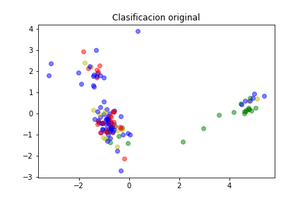

**Proyecto de Clustering en Python**

Este proyecto tiene como objetivo aplicar técnicas de clustering utilizando PCA (Análisis de Componentes Principales) y DBSCAN (Density-Based Spatial Clustering of Applications with Noise) para detectar la enfermedad de la sigatoka negra en datos multiespectrales de una planta. El propósito es identificar patrones y agrupaciones en los datos sin considerar las etiquetas preexistentes.

**Preprocesado**

Antes de aplicar las técnicas de clustering, realizamos un proceso de preprocesamiento de los datos que se describe a continuación:

1. **Cargar los datos**: Utilizamos la biblioteca pandas para cargar los datos desde un archivo CSV. Estos datos contienen información relevante para clasificar las plantas.
1. **Respaldar la columna de clasificación**: Guardamos una copia de la columna que contiene la clasificación original de las plantas. Esto nos permitirá evaluar la precisión de nuestras clasificaciones posteriores.
1. **Eliminar columnas irrelevantes**: Eliminamos las primeras seis columnas que no son relevantes para nuestro análisis.
1. **Asignar nombres de columna**: Renombramos las columnas restantes para tener nombres más descriptivos, utilizando la convención "ColumnaX" donde X es el número de la columna.
1. **Manejar valores faltantes**: Verificamos si hay valores faltantes en los datos y, en caso afirmativo, los reemplazamos con ceros. Esta estrategia fue seleccionada considerando las características específicas de los datos.
1. **Aplicar PCA**: Utilizamos la técnica de Análisis de Componentes Principales (PCA) para reducir la dimensionalidad de los datos. Aplicamos PCA con el objetivo de obtener dos componentes principales que capturen la mayor parte de la varianza de los datos.
1. **Definir el número de clústeres**: Basándonos en nuestro conocimiento del problema y en la exploración de los datos, determinamos que queríamos identificar cuatro grupos distintos.

Una vez completado el preprocesamiento de los datos, procedimos a aplicar las técnicas de clustering: PCA + k-means, PCA + K-medoids y PCA + DBSCAN. Estas técnicas nos permitieron agrupar las plantas en función de similitudes en sus características multiespectrales.

**Clasificacion**

**Resultados**

Los resultados obtenidos del clustering aplicado son importantes para comprender los patrones y agrupaciones en los datos multiespectrales. Estos resultados nos brindan información valiosa sobre las similitudes entre las plantas y nos ayudan a detectar la enfermedad de la sigatoka negra en base a las características analizadas.

Es importante tener en cuenta que los resultados del clustering están sujetos a evaluación y validación adicional. Para ello, podemos comparar nuestras clasificaciones con las etiquetas originales de las plantas y realizar análisis de calidad de los clústeres.

**Conclusiones**

En este proyecto, hemos aplicado técnicas de clustering utilizando PCA y DBSCAN para identificar patrones y agrupaciones en datos multiespectrales de plantas con el objetivo de detectar la enfermedad de la sigatoka negra. El preprocesamiento de los datos y la aplicación de las técnicas de clustering nos han permitido obtener información relevante y mejorar la comprensión de las características de las plantas y su clasificación en grupos similares.

Se recomienda realizar evaluaciones adicionales para validar los resultados y ajustar los parámetros de las técnicas de clustering utilizadas. Además, este proyecto sienta las bases para futuros análisis y aplicaciones relacionadas con el estudio y clasificación de enfermedades en plantas utilizando técnicas de aprendizaje no supervisado.

